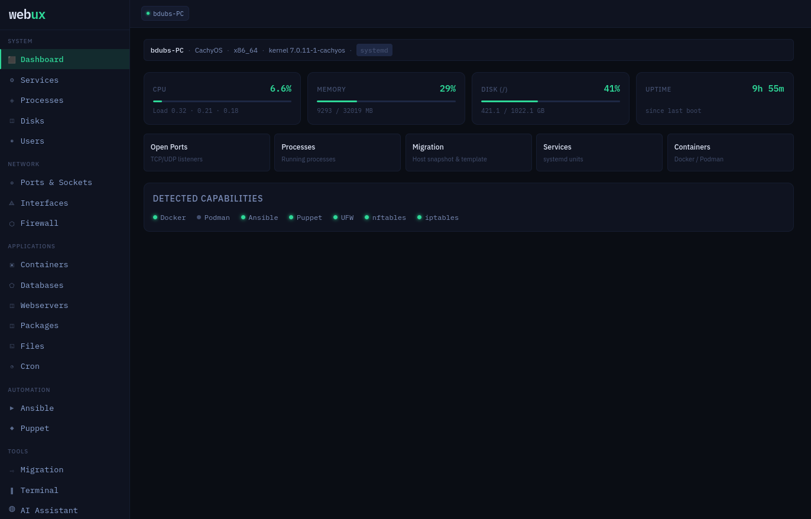
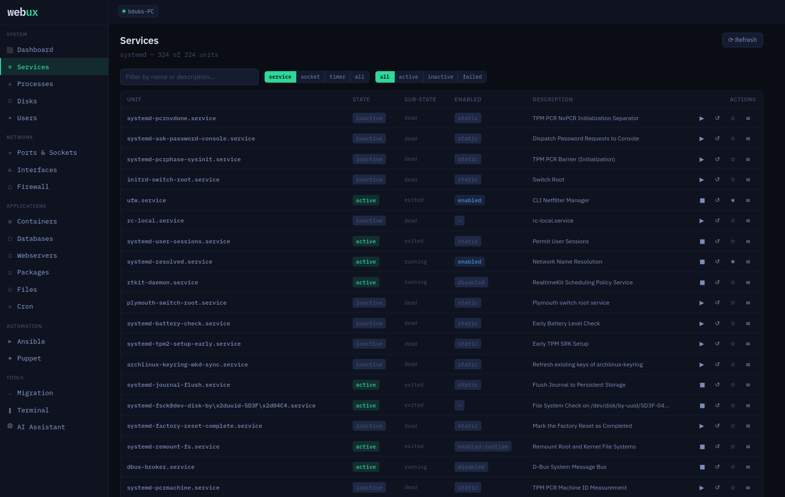
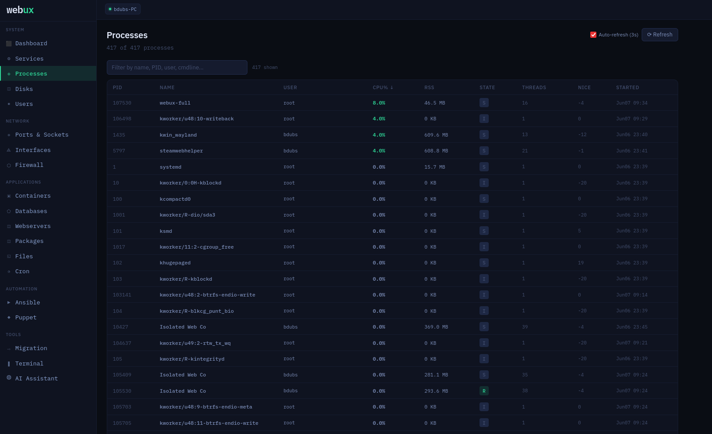
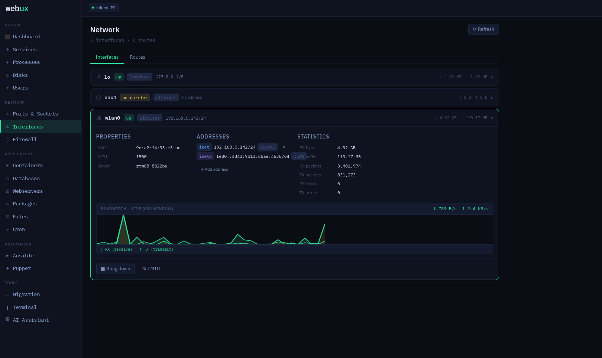
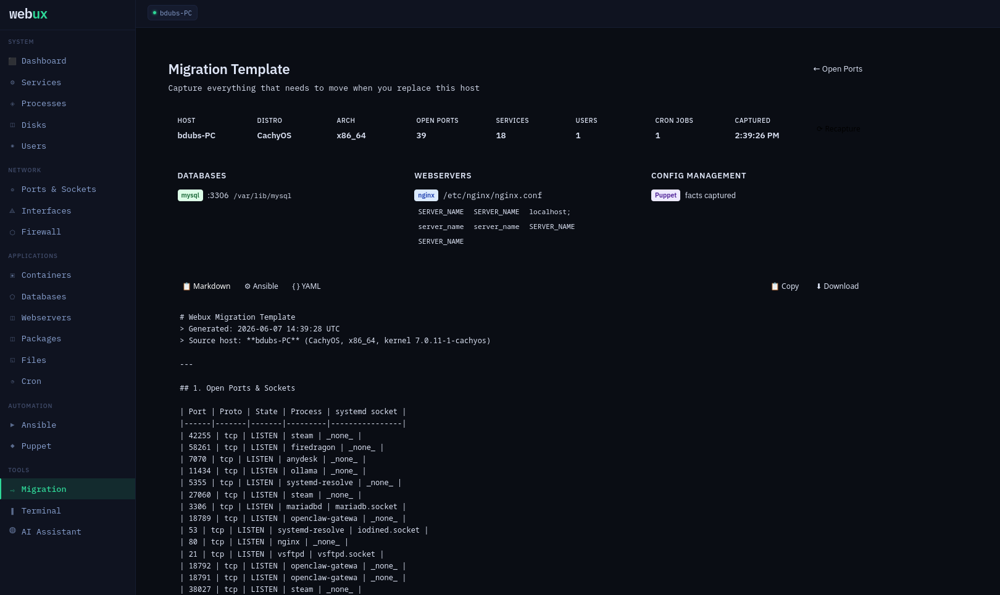

<div align="center">

```
        ██╗    ██╗███████╗██████╗ ██╗   ██╗██╗  ██╗
        ██║    ██║██╔════╝██╔══██╗██║   ██║╚██╗██╔╝
        ██║ █╗ ██║█████╗  ██████╔╝██║   ██║ ╚███╔╝ 
        ██║███╗██║██╔══╝  ██╔══██╗██║   ██║ ██╔██╗ 
        ╚███╔███╔╝███████╗██████╔╝╚██████╔╝██╔╝ ██╗
         ╚══╝╚══╝ ╚══════╝╚═════╝  ╚═════╝ ╚═╝  ╚═╝
```

**A lightweight, zero-dependency web-based Linux management panel.**  
One binary. No agents. No containers. Works on any distro.

[](LICENSE)
[](https://go.dev)
[](https://svelte.dev)

</div>

---

## Screenshots

<table>
  <tr>
    <td align="center">
      <br>
      <sub><b>Dashboard</b> — live CPU, memory, disk and uptime</sub>
    </td>
    <td align="center">
      <br>
      <sub><b>Services</b> — systemd unit management</sub>
    </td>
  </tr>
  <tr>
    <td align="center">
      <br>
      <sub><b>Processes</b> — live /proc scanner</sub>
    </td>
    <td align="center">
      <br>
      <sub><b>Network Interfaces</b> — live bandwidth sparklines</sub>
    </td>
  </tr>
  <tr>
    <td align="center" colspan="2">
      <br>
      <sub><b>Migration Template</b> — full server snapshot export</sub>
    </td>
  </tr>
</table>

---

## What is Webux?

Webux is a self-hosted Linux server management panel that runs as a **single static binary** with an embedded web UI, embedded SQLite database, and no external runtime dependencies. Install it in seconds on any Linux server — from RHEL 6 to the latest Arch — and get a full management panel immediately.

It is opinionated about being lightweight: no Docker required to run it, no systemd mandatory, no cloud account, no telemetry, no license server. Just a binary.

---

## Features

### System
| Feature | Description |
|---------|-------------|
| **Dashboard** | Live CPU, memory, disk, load average, uptime — updates in real time over WebSocket |
| **Services** | systemd/OpenRC unit management — start, stop, enable, disable, view logs. Shows all units including disabled ones |
| **Processes** | Live `/proc` scanner — CPU%, memory, PID, user, full command line |
| **Disks** | Block device tree, partition layout, mount usage bars. LVM-aware: shows Volume Groups, free space, and offers **online filesystem extension** (ext3/4, XFS, Btrfs) when VG free space is available — no reboot required |
| **Users & Groups** | Full CRUD for Linux users and groups via `useradd`/`usermod`/`groupadd` |

### Network
| Feature | Description |
|---------|-------------|
| **Ports & Sockets** | Reads `/proc/net/tcp*`, `/proc/net/udp*` directly — no `ss` or `netstat` needed. Cross-references `/proc/<pid>/fd` to show owning process. Enriches with systemd socket unit names |
| **Interfaces** | Network interface list with live bandwidth sparklines (SSE streaming) |
| **Firewall** | ufw, nftables, and iptables rule viewer and management |

### Applications
| Feature | Description |
|---------|-------------|
| **Containers** | Docker and Podman via their Unix sockets — list, start, stop, remove |
| **Databases** | Auto-detect MySQL/MariaDB, PostgreSQL, Redis. Inline query panel |
| **Webservers** | Nginx, Apache, Caddy — status, config editor, reload, virtual host list |
| **Packages** | pacman, apt, dnf/yum — install, remove, upgrade, search. Flatpak support. **Repository management**: add/remove/enable/disable repos, manage Flatpak remotes |
| **Files** | Full file browser with inline editor and save-to-disk |
| **Cron** | System and per-user crontab viewer and editor |

### Automation
| Feature | Description |
|---------|-------------|
| **Ansible** | Scans a configurable playbook directory. Parses declared variables (`vars:`, `vars_prompt:`) and renders input boxes. Runs playbooks with live SSE output streaming. If Ansible is not installed, offers one-click install via the native package manager |
| **Puppet** | Reads puppet.conf, views facts, catalog status, last run report |

### Tools
| Feature | Description |
|---------|-------------|
| **Migration Template** | Snapshots everything needed to replicate a server: ports, services, databases, webserver vhosts, cron, users, firewall rules, env vars, Puppet facts. Exports as Markdown checklist, annotated YAML, or Ansible playbook skeleton |
| **Terminal** | Full PTY terminal in the browser (xterm.js). Spawns the user's login shell. Quick-command chips configurable in settings. **Play button** in Learn Mode runs any CLI-equivalent command directly in the terminal |
| **AI Assistant** | Ollama-first (self-hosted, no API key needed). Includes a setup wizard, model browser with RAM requirements, and one-click model pull with progress streaming. Also supports OpenAI, Anthropic, and any OpenAI-compatible endpoint. Every chat message automatically injects live system context (CPU, RAM, failed services, open ports) |
| **Learn Mode** | Every action emits its CLI shell equivalent to a collapsible pane at the bottom of every page. Each command has a **▶ play button** that runs it in the terminal — navigate to the terminal automatically if needed |

---

## Authentication

Webux supports **PAM authentication** (full system auth including LDAP, SSSD, 2FA) when built with `-tags pam`, or `/etc/shadow` + `crypt(3)` verification (supports yescrypt, SHA-512, SHA-256, bcrypt) in the default build.

Sessions are **JWT** (HS256, 24-hour HttpOnly cookie). The JWT secret is auto-generated on first run and stored in SQLite.

### SSO bypass token

For integration with internal SSO systems, set a bypass token in `config.yaml` or the Settings page:

```yaml
auth:
  bypass_token: "your-long-random-token-here"
```

Your SSO system redirects users to:
```
http://yourserver:8989/auth/bypass?token=<token>
```

Webux issues a real JWT session and redirects to the dashboard. The token can also be passed as an `X-Webux-Token` HTTP header for API access.

---

## Quick start

```bash
# Build from source
git clone https://github.com/yourusername/webux
cd webux
go mod tidy
make build-full          # CGO enabled — supports all password hash types
sudo WEBUX_DATA_DIR=/var/lib/webux ./build/webux-full

# Open — login with your Linux username and password
open http://localhost:8989
```

### Install as a service

```bash
sudo make install        # installs binary + systemd unit
sudo systemctl enable --now webux
```

### Development (no auth)

```bash
sudo WEBUX_DATA_DIR=/tmp/webux-data ./build/webux-full --no-auth
```

---

## Build targets

```bash
make build          # Current arch, no DB drivers, CGO_ENABLED=1
make build-full     # All DB drivers (mysql + postgres), CGO_ENABLED=1
make build-pam      # Full PAM auth + all DB drivers (requires libpam-dev)

make release        # Cross-compile for amd64, arm64, armv7, 386
make release-full   # Cross-compile with all DB drivers

make package        # Build .deb, .rpm, .tar.gz (requires fpm: gem install fpm)
make checksums      # SHA256 checksums for release binaries

VERSION=1.0.0 make release   # Override version (strips leading v for packages)
```

### PAM build requirements

```bash
# Arch/CachyOS
sudo pacman -S pam

# Debian/Ubuntu
sudo apt install libpam0g-dev

# RHEL/Fedora
sudo dnf install pam-devel
```

### Package runtime dependency

The default build (`build-full`) uses `crypt(3)` from the system libxcrypt. This is pre-installed on every modern Linux distro. The generated `.deb` and `.rpm` declare `libxcrypt2 | libcrypt1` as a dependency — `apt install` and `dnf install` will never need to pull it because it's always already present.

---

## Architecture

```
cmd/webux/
  main.go             # Startup, config, auth wiring, graceful shutdown
  embed.go            # //go:embed dist — entire web UI in the binary

internal/
  api/
    router.go         # chi router — all routes, middleware, auth
    handlers/         # One file per feature: services, disks, packages, ...
  auth/
    auth.go           # JWT (HS256), SSO bypass, shadow verification
    pam.go            # PAM via CGO (-tags pam)
    pam_stub.go       # Shadow fallback (no CGO)
    crypt_cgo.go      # crypt(3) via libxcrypt (yescrypt, SHA-512, etc.)
    crypt_stub.go     # bcrypt-only fallback
  config/config.go    # YAML + environment variable config
  db/
    db.go             # SQLite open + migration runner
    migrations/       # 001_init … 006_auth SQL files
  learn/              # CLI echo ring buffer + WebSocket broadcast
  system/
    detect.go         # Distro/init system detection
    initsys/          # systemd (dbus) + OpenRC + SysV interfaces
    processes/        # /proc scanner
    users/            # /etc/passwd + shadow + group
    network/
      ports/          # /proc/net scanner
      interfaces/     # Network interface info + bandwidth
      firewall/       # ufw / nftables / iptables
    containers/       # Docker + Podman socket clients
    databases/        # MySQL, PostgreSQL detection + query
    webservers/       # Nginx, Apache, Caddy
    packages/         # pacman, apt, dnf/yum + Flatpak + repo management
    files/            # File browser + editor
    cron/             # Crontab parser + editor
    disks/            # lsblk, df, LVM (pvs/vgs/lvs), filesystem resize
    ansible/          # Playbook scanner, variable extractor, runner
    ai/               # Ollama + OpenAI-compatible chat client
  ws/hub.go           # WebSocket hub — real-time metrics, CLI echoes

web/src/
  App.svelte          # SPA shell, auth check, hash router
  routes/             # One .svelte file per page (20+ pages)
  components/
    Sidebar.svelte    # Navigation
    Topbar.svelte     # Hostname, live indicator, logout
    CLIEchoPane.svelte # Learn mode — fixed bottom drawer with ▶ play buttons
  lib/
    api.ts            # Typed fetch wrapper
    ws.ts             # WebSocket store
```

---

## Dependency philosophy

Webux aims for the minimum viable set of Go dependencies at runtime:

| Concern | Solution | CGO? |
|---------|----------|------|
| HTTP routing | `go-chi/chi` | No |
| WebSocket | `gorilla/websocket` | No |
| SQLite | `ncruces/go-sqlite3` (WASM driver) | **No** |
| systemd | `godbus/dbus` (no forking `systemctl`) | No |
| PTY (terminal) | `creack/pty` | No |
| Password hashing | `golang.org/x/crypto` (bcrypt) | No |
| crypt(3) — yescrypt, SHA-512 | system libxcrypt via CGO | **Yes** |
| PAM (optional) | `libpam` via CGO (`-tags pam`) | **Yes** |
| YAML config | `gopkg.in/yaml.v3` | No |
| Frontend | Vite + Svelte 5, embedded at build time | Dev only |

Runtime: **one binary + one SQLite file**. The binary is ~20–30 MB depending on build flags.

---

## Configuration

`/etc/webux/config.yaml` (created by installer, or pass `--config /path/to/config.yaml`):

```yaml
listen_addr: ":8989"          # Default port — change here or in Settings UI
data_dir: "/var/lib/webux"    # SQLite DB and other runtime data

log:
  level: "info"               # debug | info | warn | error

auth:
  bypass_token: ""            # SSO bypass — leave blank to disable
  jwt_secret: ""              # Leave blank — auto-generated on first run
  disabled: false             # Set to true for dev (or use --no-auth flag)
```

All settings can also be set via environment variables:

```bash
WEBUX_LISTEN_ADDR=":9000"
WEBUX_DATA_DIR="/opt/webux/data"
WEBUX_BYPASS_TOKEN="your-token"
WEBUX_AUTH_DISABLED="true"
```

Settings editable in the UI (persisted to SQLite):
- Web UI port
- Ansible playbook directory and inventory file
- Puppet config directory
- SSO bypass token
- AI provider (Ollama URL, model, API keys)
- Terminal shell override and quick commands

---

## LVM disk extension

When the Disks page detects LVM and a Volume Group has free space, mounted logical volumes show a **+ Extend** button. The wizard:

1. Shows the LV path, current usage, filesystem type, and available VG free space
2. Accepts a size in GB (capped at VG free space)
3. Previews the exact commands before running
4. Streams `lvextend` + filesystem resize output live

Supported filesystems for online (no unmount) extension:

| Filesystem | Resize tool | Requires mount? |
|------------|-------------|-----------------|
| ext3 | `resize2fs` | No — works on unmounted too |
| ext4 | `resize2fs` | No — works on unmounted too |
| XFS | `xfs_growfs <mountpoint>` | **Yes** — must be mounted |
| Btrfs | `btrfs filesystem resize max <mountpoint>` | **Yes** — must be mounted |

---

## Supported distributions

Webux is a static binary — it runs on any Linux with kernel 3.10+.

| Distro family | Package manager | Init system | Notes |
|--------------|----------------|-------------|-------|
| Arch / CachyOS / Manjaro | pacman | systemd | Fully tested |
| Debian / Ubuntu 18+ | apt | systemd | .deb available |
| RHEL / CentOS / Fedora | dnf / yum | systemd | .rpm available |
| Alpine | apk | OpenRC | Binary works; no .apk yet |
| Any SysV distro | any | SysV | Universal installer handles init |

Cross-compiled architectures: **amd64, arm64, armv7, 386**

---

## Universal installer

```bash
# Download and run (installs binary + detects init system automatically)
curl -fsSL https://github.com/yourusername/webux/releases/latest/download/install.sh | sudo sh

# Or with a specific version
sudo sh install.sh --version 1.0.0

# Skip service setup (binary only)
sudo sh install.sh --no-service
```

The installer auto-detects:
- CPU architecture (`uname -m`)
- OS and package manager (`/etc/os-release`)
- Init system (systemd → OpenRC → SysV)

---

## Package installation

```bash
# Debian / Ubuntu
dpkg -i webux_1.0.0_amd64.deb
# Service is enabled and started automatically via post-install hook

# RHEL / Fedora / CentOS
rpm -i webux-1.0.0-1.x86_64.rpm

# Universal tarball
tar xzf webux-1.0.0-linux-amd64.tar.gz
sudo sh usr/local/share/webux/install.sh
```

---

## PAM configuration

When built with `-tags pam`, Webux uses `/etc/pam.d/webux`:

```
# /etc/pam.d/webux
auth       required     pam_unix.so
auth       optional     pam_sss.so          # SSSD / LDAP
# auth    required     pam_google_authenticator.so  # TOTP 2FA

account    required     pam_unix.so
account    optional     pam_sss.so
```

Install: `sudo cp scripts/webux.pam /etc/pam.d/webux`

Without the PAM build tag, Webux reads `/etc/shadow` directly using `crypt(3)` via libxcrypt — supporting yescrypt (`$y$`), SHA-512 (`$6$`), SHA-256 (`$5$`), and bcrypt (`$2b$`).

---

## Security notes

- Webux requires root (or equivalent) to access `/etc/shadow`, manage services, run LVM commands, and read `/proc`. Run it as root or with appropriate capabilities.
- The JWT secret is stored in SQLite. Back up `/var/lib/webux/webux.db` to preserve sessions across reinstalls.
- The SSO bypass token grants full admin access — treat it like a root password.
- All API endpoints (except `/auth/login` and static assets) require a valid JWT. WebSocket connections are also gated.
- No data is sent to external services unless you configure an AI provider API key.

---

## License

**AGPL-3.0-or-later**

If you run a modified version of Webux as a network service, you must make the source available to users of that service.
